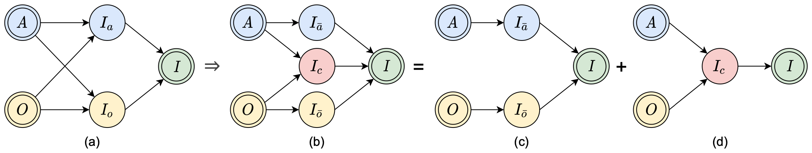

# A Decomposable Causal View (DeCa) of CZSL
Code for the IEEE Trans. Multimedia paper:

> **Title:** A Decomposable Causal View of Compositional Zero-Shot Learning<br>
> **Authors:** Muli Yang, Chenghao Xu, Aming Wu, and Cheng Deng<br>
> **Paper:** [IEEE Xplore](https://ieeexplore.ieee.org/document/9864072), [PDF](./assets/paper.pdf)


## Introduction
**Abstract:** Composing and recognizing novel concepts that are combinations of known concepts, i.e., compositional generalization, is one of the greatest power of human intelligence. With the development of artificial intelligence, it becomes increasingly appealing to build a vision system that can generalize to unknown compositions based on restricted known knowledge, which has so far remained a great challenge to our community. In fact, machines can be easily misled by superficial correlations in the data, disregarding the causal patterns that are crucial to generalization. In this paper, we rethink compositional generalization with a causal perspective, upon the context of Compositional Zero-Shot Learning (CZSL). We develop a simple yet strong approach based on our novel Decomposable Causal view (dubbed “DeCa”), by approximating the causal effect with the combination of three easy-to-learn components. Our proposed DeCa is evaluated on two challenging CZSL benchmarks by recognizing unknown compositions of known concepts. Despite being simple in the design, our approach achieves consistent improvements over state-of-the-art baselines, demonstrating its superiority towards the goal of compositional generalization.
<br>
<p align="center">
     <br />
    <em>
    The causal graph of CZSL, and our decomposable causal view.
    </em>
</p>


## Setup

This project is built on top of [CZSL](https://github.com/ExplainableML/czsl).
Please follow its instructions to prepare the python environment.
Specifically, one can use the following codes to create and activate a conda virtual environment with the specified packages (please first ensure Anaconda or Miniconda is in use):
```
conda env create --file environment.yml
conda activate czsl
```


Also, please use the code below to download the datasets and embeddings:
```
bash ./utils/download_data.sh DATA_ROOT
```
in which `DATA_ROOT` is the path where you would like to store the data.


## Commands

### Training

Please use the following code to train a model:
```
python train.py --config CONFIG_FILE
```
in which `CONFIG_FILE` is the path to the configuration file of the model. One can find it in the `./configs` folder, whose original definition can be found in `./flags.py`.

One can also use `CUDA_VISIBLE_DEVICES=GPU_IDs` to specify CUDA resources. For instance, to train a DeCa model on Mit-States using GPU 0, just run
```
CUDA_VISIBLE_DEVICES=0 python train.py --config configs/deca/mit.yml
```

### Testing


Please use the following code to test a model after training:
```
python test.py --logpath LOG_DIR
```
in which `LOG_DIR` is the path to the logs of a model (defined by the `name` argument in the config file).

For instance, to test a trained DeCa model whose logs are stored in `./logs/deca/mit`, one can use  
```
CUDA_VISIBLE_DEVICES=0 python test.py --logpath logs/deca/mit
```


[//]: # (## TODO)

[//]: # (## Acknowledgements)

## Citations
If you find our work helpful, please consider citing our [paper](https://ieeexplore.ieee.org/document/9864072):
```
@article{yang2022decomposable,
  author={Yang, Muli and Xu, Chenghao and Wu, Aming and Deng, Cheng},
  journal={IEEE Transactions on Multimedia}, 
  title={A Decomposable Causal View of Compositional Zero-Shot Learning}, 
  year={2022},
  volume={},
  number={},
  pages={1-11},
  doi={10.1109/TMM.2022.3200578}
}
```
If you use our code, please also consider citing the following two papers in [CZSL](https://github.com/ExplainableML/czsl):
```
@inproceedings{naeem2021learning,
  title={Learning Graph Embeddings for Compositional Zero-shot Learning},
  author={Naeem, MF and Xian, Y and Tombari, F and Akata, Zeynep},
  booktitle={34th IEEE Conference on Computer Vision and Pattern Recognition},
  year={2021},
  organization={IEEE}
}

@inproceedings{mancini2021open,
  title={Open World Compositional Zero-Shot Learning},
  author={Mancini, M and Naeem, MF and Xian, Y and Akata, Zeynep},
  booktitle={34th IEEE Conference on Computer Vision and Pattern Recognition},
  year={2021},
  organization={IEEE}
}
```
as well as this paper (since some scripts are also adapted from its [repository](https://github.com/Tushar-N/attributes-as-operators)):
```
@inproceedings{nagarajan2018attributes,
  title={Attributes as operators: factorizing unseen attribute-object compositions},
  author={Nagarajan, Tushar and Grauman, Kristen},
  booktitle={Proceedings of the European Conference on Computer Vision (ECCV)},
  pages={169--185},
  year={2018}
}
```
